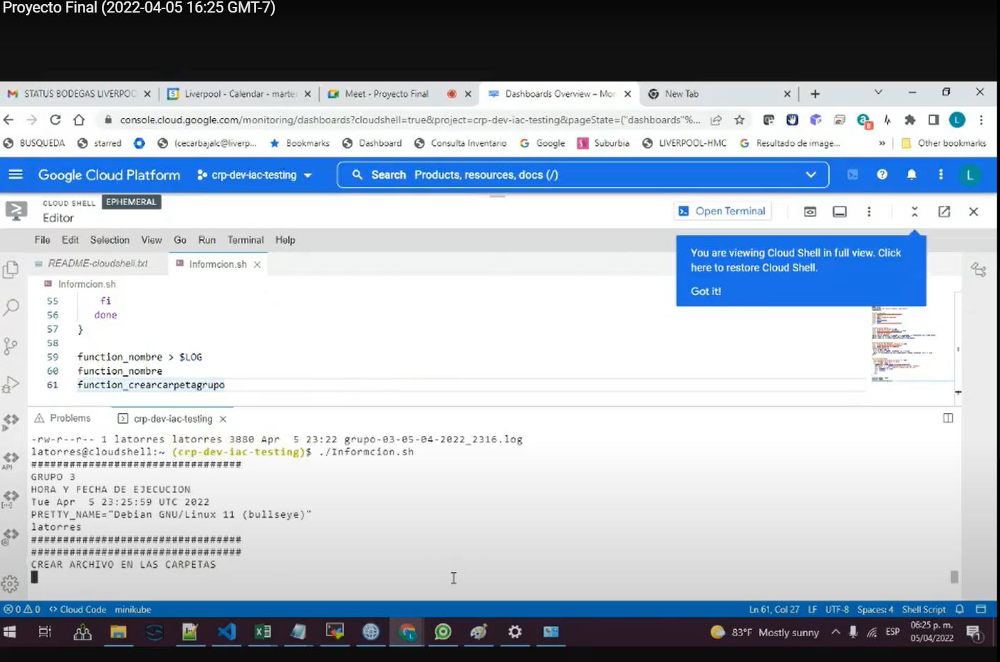
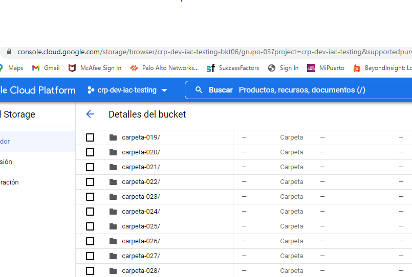

<h1 align="center"> Proyecto Final </h1>

> ### `Grupo 3:` [**Automation Adoption Training**](https://classroom.google.com/c/NDc3NDE2Njk4MjM2/a/NDgxMTUxNDQ0MzUz/details)

|INTREGRANTES  | PARTICIPACIÓN      | 
|------------- | --------------     |
|Carlos        | PROGRAMADOR        |
|Mike          | PROGRAMADOR        |
|Valente       | DOCUMENTADOR       |
|Jorge         | --------------     |
|Daniela       | PROGRAMADOR        |
|Luis          | PROGRAMADOR        |
|Javier        | PUSH Y COMENTARIOS |
|Marco         | DOCUMENTADOR       |
|José Carlos   | PROGRAMADOR        |
|Cinthya       |  DOCUMENTADOR      |
|Alberto       | --------------     |
|Luis          | --------------     |
|Gilberto      | --------------     |
|Fernando      | LIDER              |

## Documentación 

> #### **Evidencia de trabajo en equipo** :film_strip: [Evidencia, por favor da clic `aquí`.](https://mail.google.com/mail/u/0/?tab=rm&ogbl#inbox/FMfcgzGmvnzQrwKRjNdzRqKwsCkBKvSL?projector=1) :film_strip:

<!-- Este deberia ser el video -->

##Imagen de carpetas
#Evidencia  de las 100 carpetas generadas

