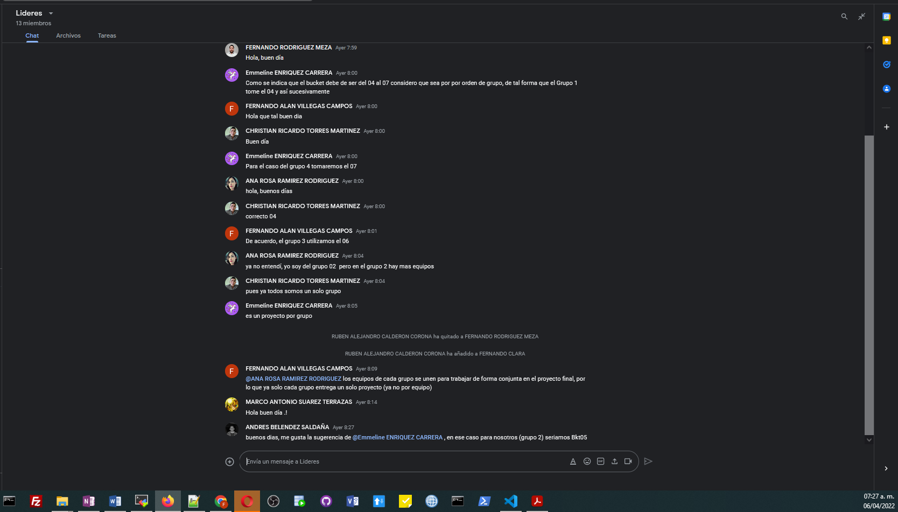

<h1 align="center"> Proyecto Final </h1>

> ### `Grupo 3:` [**Automation Adoption Training**](https://classroom.google.com/c/NDc3NDE2Njk4MjM2/a/NDgxMTUxNDQ0MzUz/details)

|INTREGRANTES  | PARTICIPACIÓN      | 
|------------- | --------------     |
|Carlos        | PROGRAMADOR        |
|Mike          | PROGRAMADOR        |
|Valente       | DOCUMENTADOR       |
|Jorge         | PROGRAMADOR        |
|Daniela       | PROGRAMADOR        |
|Luis          | PROGRAMADOR        |
|Javier        | DOCUMENTADOR       |
|Marco         | DOCUMENTADOR       |
|José Carlos   | PROGRAMADOR        |
|Cinthya       | DOCUMENTADOR       |
|Alberto       | DOCUMENTADOR       |
|Luis          | DOCUMENTADOR       |
|Gilberto      | DOCUMENTADOR       |
|Fernando      | LIDER              |

## Documentación 

> #### **Evidencia de trabajo en equipo** :film_strip: [Evidencia, por favor da clic `aquí`.](https://mail.google.com/mail/u/0/?tab=rm&ogbl#inbox/FMfcgzGmvnzQrwKRjNdzRqKwsCkBKvSL?projector=1) :film_strip:

<!-- Este deberia ser el video -->

## Imagen de carpetas
# Evidencia  de las 100 carpetas generadas

## Imagen de carpetas con archivos no vacios
# Evidencia  de las carpetas con archivos no vacios como prueba:

## Evidencia asignacion de Buckets por Grupo

## Comentario:
De forma general se trabajó bien en el equipo, con la participación y conocimiento de los integrantes fue posible complementar de buena forma el script para cumplir con el objetivo. Agradezco mucho el apoyo de todos los integrantes del grupo ya que a pesar de las actividades del día a día fue posible completar este proyecto final.
